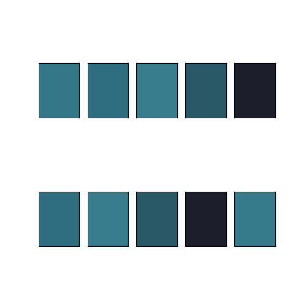

# ColorpaletteFromImage



Code to create a color palette and a flat image of palette colors from a single image.

## News

* [Sep 04 2021] Source code is published.

## Example

1. Install dependencies:
```sh
pip install -r requirement.txt
```

2. Run:
```sh
python3 ColorpaletteFromImage.py --img test_img.jpg
```
A colorpalette directory is created and a flat image is created in it.


